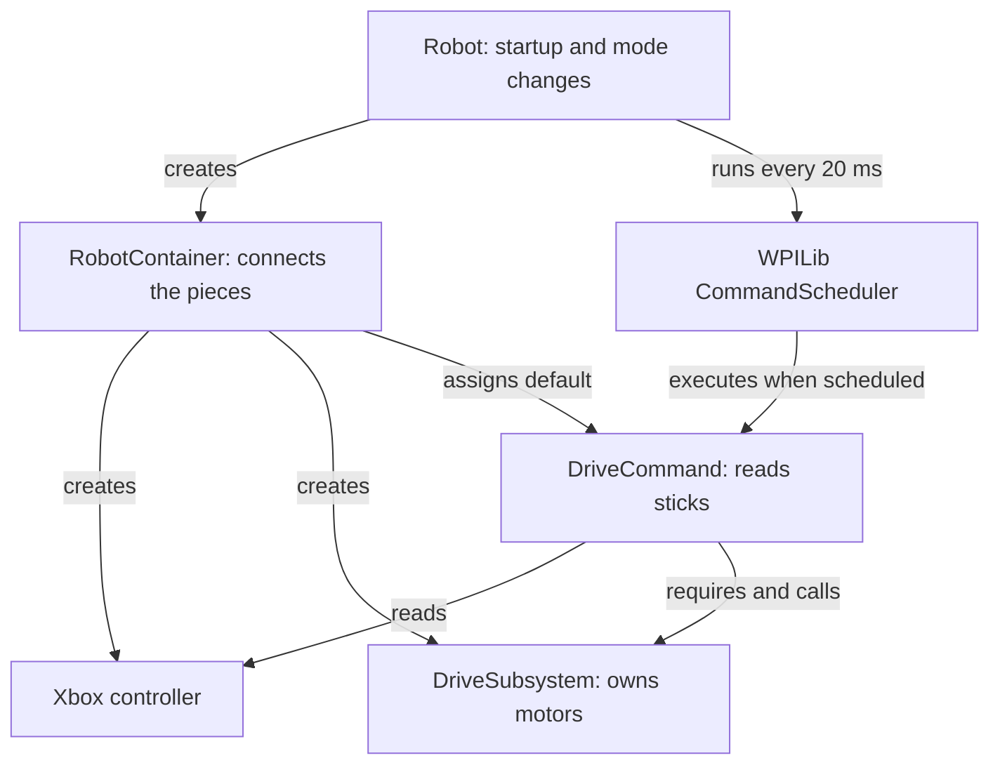
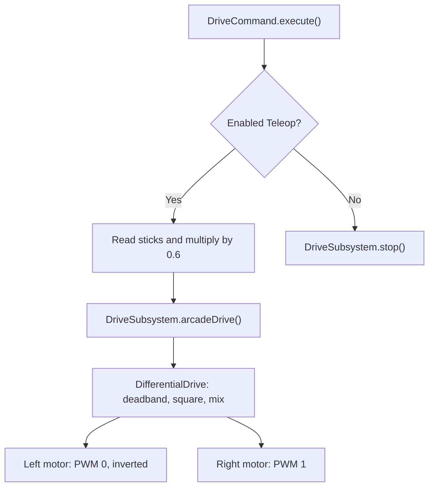

# ShaqBot: Command-Based Robot

ShaqBot uses WPILib's command-based framework to organize hardware, driver controls, and robot actions.

The robot currently includes a differential drivetrain controlled by an Xbox controller. Additional mechanisms can be added using the same subsystem-and-command structure.

This branch converts the original working program to command-based code while preserving its hardware configuration and Teleop driving response. The original implementation remains available on [`main` in BrewerFRC/ShaqBot](https://github.com/BrewerFRC/ShaqBot/tree/main).

## Start here

Read the files in this order:

| File | Question it answers |
|---|---|
| [`Robot.java`](java/src/main/java/frc/robot/Robot.java) | What happens at startup and when robot modes change? |
| [`RobotContainer.java`](java/src/main/java/frc/robot/RobotContainer.java) | How are hardware, controls, and commands connected? |
| [`commands/DriveCommand.java`](java/src/main/java/frc/robot/commands/DriveCommand.java) | What does the robot do with the sticks? |
| [`subsystems/DriveSubsystem.java`](java/src/main/java/frc/robot/subsystems/DriveSubsystem.java) | How do those requests reach the motors? |

The Java files are under `java/src/main/java/frc/robot/`. `Main.java` starts the robot program and is unchanged by this conversion.

## What does command-based mean?

A **subsystem** represents a robot mechanism and owns its hardware. ShaqBot currently has one: the drivetrain.

A **command** describes an action. The drive command repeatedly reads the controller and requests drivetrain movement.

The **scheduler** is WPILib code that manages commands. It decides which commands can run, calls their methods, and coordinates commands that need the same subsystem.

`RobotContainer` creates these objects and connects them. The robot still extends `TimedRobot`: command-based adds a scheduler to the normal repeating loop.

We do not implement our own scheduler. `Robot.robotPeriodic()` calls WPILib's shared scheduler once per cycle:

```java
CommandScheduler.getInstance().run();
```

## How the current pieces connect

Arrows are labeled with what each connection does. Creating objects happens at startup; executing commands happens repeatedly.



## How stick input reaches the motors

When the drive command is scheduled, the scheduler calls its `execute()` method, normally every 20 milliseconds (50 times per second).



This diagram follows the drive command only. During Autonomous, the current hold-stopped command requires the drivetrain, so the default drive command does not run.

While disabled, normal commands do not execute, and WPILib prevents motor operation.

## Current controls and hardware settings

| Setting | Current value | Defined in |
|---|---|---|
| Left motor PWM port | 0 | `DriveSubsystem` |
| Right motor PWM port | 1 | `DriveSubsystem` |
| Left motor inversion | `true` | `DriveSubsystem` |
| Right motor inversion | `false` | `DriveSubsystem` |
| Controller USB slot | 0 | `RobotContainer` |
| Input scaling | 0.6 | `DriveCommand` |

PWM ports are roboRIO connections, not CAN device IDs.

The drive command preserves the original controls:

```java
double forward = -controller.getLeftY() * INPUT_SCALE;
double turn = -controller.getRightX() * INPUT_SCALE;
```

The negative signs preserve the original direction mapping. The scale is applied before `DifferentialDrive` processes the inputs. The helper:

1. Applies a small deadband to ignore inputs near zero.
2. Squares input magnitudes while retaining their signs.
3. Combines forward and turning inputs into left/right outputs.

Therefore, `0.6` does **not** mean a direct 60% motor output limit. Full forward stick with no turning produces approximately 35% output after the default deadband and squaring.

## What changed from the original?

| Original | Converted |
|---|---|
| Motors and controller in `Robot.java` | Motors in the subsystem; controller in `RobotContainer` |
| Joystick driving in `robotPeriodic()` | Joystick driving in `DriveCommand.execute()` |
| Drive code runs in all modes | Stick-driven movement allowed only in enabled Teleop |
| Autonomous chooser with empty options | Explicit command that holds the drivetrain stopped |
| No scheduler coordination | Commands declare which subsystem they control |

The port numbers, inversion, axes, input scaling, and arcade-drive processing remain the same. The unused timer and empty autonomous chooser are removed.

## Why declare a requirement?

This line tells the scheduler that the drive command uses the drivetrain:

```java
addRequirements(drivetrain);
```

A second command requiring the drivetrain cannot run alongside it. The scheduler either interrupts the existing command or rejects the new one, depending on the existing command's interruption behavior. The commands in this project use the default behavior: the existing command is interrupted.

Requirements coordinate scheduled commands. They do not prevent arbitrary code from calling motor methods. That is why the motors are private and drivetrain actions are kept in the subsystem.

## What is a default command?

The default command is the action the scheduler starts when a subsystem is available and the command is allowed to run.

For the current drivetrain, that action is driver control:

```java
drivetrain.setDefaultCommand(
    new DriveCommand(drivetrain, driverController));
```

When autonomous requires the drivetrain, the default command yields. When autonomous is canceled at the start of Teleop, the scheduler can start the default command again.

Default does not automatically mean Teleop only. The drive command explicitly checks the mode.

## Current behavior in each mode

| Mode | Program behavior |
|---|---|
| Disabled | Normal commands cannot run; motor operation is disabled |
| Autonomous | The autonomous command repeatedly stops the drivetrain |
| Teleop | The default drive command reads the sticks and drives |
| Test | Existing commands are canceled; the drive command's mode check prevents Xbox driving |

Dashboard actuator controls can separately operate hardware in Test. Treat Test as an enabled mode.

## Command lifecycle

| Method | Meaning | Drive command behavior |
|---|---|---|
| Constructor | Creates the command object | Stores references and declares the drivetrain requirement |
| `initialize()` | Runs each time the command starts | Uses WPILib's empty default implementation |
| `execute()` | Runs repeatedly while scheduled | Checks the mode, reads sticks, and requests movement |
| `isFinished()` | Checks whether the command should finish | Returns `false` |
| `end()` | Runs when finished or interrupted | Stops the drivetrain |

The constructor runs when an object is created. `initialize()` runs whenever that object is scheduled to start. A default command should continue running rather than immediately finish and restart.

## Why organize the code this way?

| Choice | Reason |
|---|---|
| Keep hardware private in its subsystem | Motor configuration and motor access can be found together |
| Declare command requirements | Lets the scheduler coordinate competing actions |
| Stop when the drive command ends | Clears the previous motor request during a transition |
| Cancel autonomous when Teleop begins | Returns control to the driver |
| Keep constants near their use | Settings and the code they affect can be read together |
| Keep button bindings in `RobotContainer` | Provides one place to connect controls to actions |
| Use a separate drive-command file | Makes the lifecycle visible for learning |

A separate constants file is optional. Small commands can also be written inline. This project uses a separate drive command for teaching clarity.

`configureBindings()` is currently empty because there are no button actions yet.

## Adding a mechanism

Use the same structure when adding an intake, arm, elevator, or other mechanism:

1. Create a subsystem in `subsystems/` that owns its motors and sensors. Put hardware constants near the code that uses them.
2. Provide methods describing what the mechanism can do, including how to stop it.
3. Define commands for its actions. Each command must require every subsystem it controls and handle ending or interruption appropriately.
4. Create the subsystem in `RobotContainer` and pass it to its commands.
5. Connect button actions in `configureBindings()`. WPILib's `CommandXboxController` provides convenient button triggers if controls expand beyond the current stick-only setup.
6. Set a default command only if the mechanism needs an ongoing idle action. Not every subsystem needs one.
7. Update the hardware table, diagrams, operating instructions, and verification steps.

Commands for independent subsystems can run together: an intake command can run while the driver controls the drivetrain. Commands requiring the same subsystem are coordinated by the scheduler.

The current autonomous command is a placeholder. Add planned autonomous actions through `getAutonomousCommand()` as capabilities grow. A future command that owns multiple subsystems must declare all of those requirements.

## Reading the Java

| Syntax | Meaning here |
|---|---|
| `private` | Only this class directly accesses the member |
| `static final` | A constant associated with the class |
| `new` | Creates an object |
| `extends` | Builds on a WPILib class |
| `@Override` | Supplies our implementation of an inherited method |
| `this.drivetrain = drivetrain` | Stores the drivetrain passed into the constructor |
| `drivetrain::stop` | Passes the stop method as an action to call later |

A `final` reference cannot be reassigned. The object it refers to can still change; for example, a motor controller can receive new output values.

## Current dashboard information

The `Drivetrain` entry exposes the drive object for inspection. Displayed outputs are software requests, not measured wheel speeds. The current code has no wheel encoders or speed measurements.

## Build and deploy

This project targets WPILib **2024.3.2** and Java **17**. This conversion does not upgrade dependencies.

1. Open the repository's `java` folder in the matching WPILib VS Code environment.
2. Confirm the project team number is 4564.
3. Run **WPILib: Build Robot Code**.
4. Connect to ShaqBot.
5. Run **WPILib: Deploy Robot Code**.
6. Confirm the Xbox controller is in Driver Station USB slot 0.

The `java` folder contains the Gradle project. If the team number is not configured, set it through the WPILib project tools before deploying.

## Check the current robot behavior

Begin with the robot secured and the wheels clear of the floor.

| Check | Expected result |
|---|---|
| Move sticks while Disabled | No movement |
| Drive forward/backward in Teleop | Same directions and response as the original |
| Turn in Teleop | Same turning response as the original |
| Release sticks | Motors stop |
| Move sticks in Autonomous | No joystick-driven movement |
| Move sticks in Test | No joystick-driven movement |
| Disable while driving | Motors stop |
| Switch from Autonomous to Teleop | Driver control becomes available |

Then compare normal floor driving with the original program. Expand these checks when mechanisms or commands are added.

### Conversion verification status

The conversion was reviewed against WPILib 2024.3.2 source, and both Mermaid diagrams were rendered and visually checked. A build attempt stopped before Java compilation because the review environment could not download Gradle 8.5. Compilation, deployment, and robot behavior still need verification in the team's WPILib environment.

## Student exercises

1. Trace left-stick input through the command and subsystem to the motors.
2. Explain why `execute()` reads the sticks every cycle.
3. Explain what happens when another command requires the drivetrain.
4. Predict how changing `INPUT_SCALE` to `0.4` affects driving.
5. Explain why `configureBindings()` is empty even though the controller works.
6. Describe which files you would add or change to give an intake a button-controlled command.

## References

- [WPILib command-based structure](https://docs.wpilib.org/en/stable/docs/software/commandbased/structuring-command-based-project.html)
- [WPILib command scheduler](https://docs.wpilib.org/en/stable/docs/software/commandbased/command-scheduler.html)
- [WPILib button bindings](https://docs.wpilib.org/en/stable/docs/software/commandbased/binding-commands-to-triggers.html)

This branch follows the repository's existing WPILib version. Current online documentation may contain examples from newer releases.
